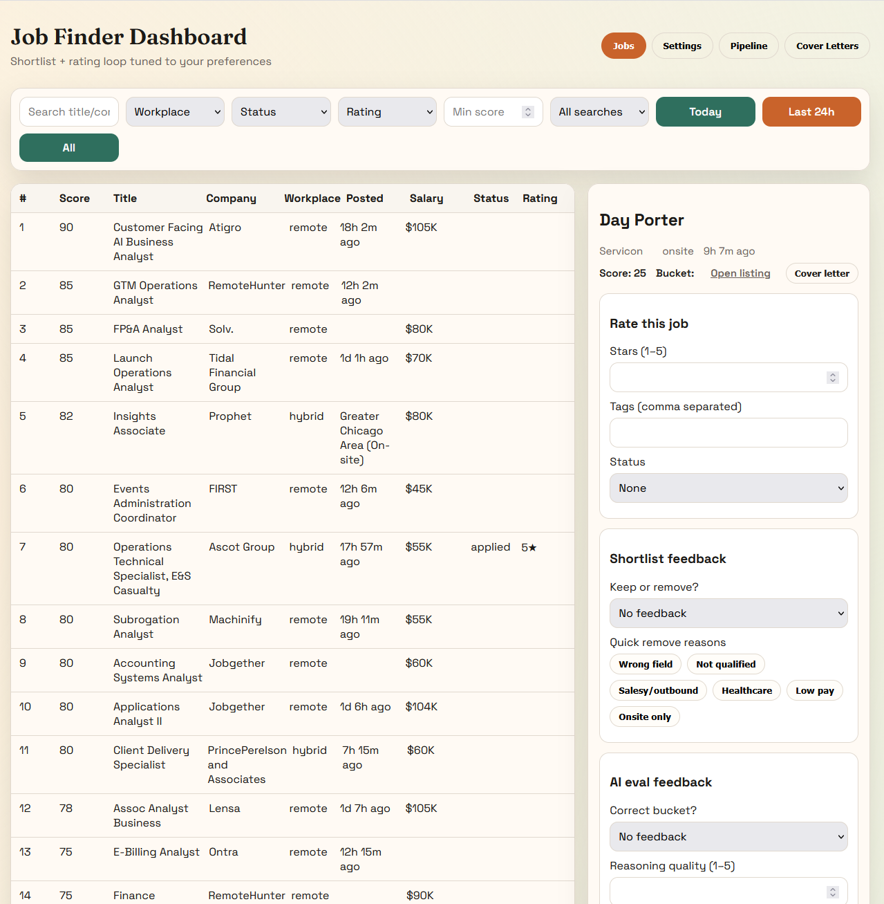

# Job Finder Dashboard

Local-first job intelligence pipeline with a FastAPI backend, React dashboard, and feedback-driven ranking loop.

## Preview



## Highlights

- End-to-end pipeline: `scout -> shortlist -> scrape -> eval` (+ optional `sort`)
- Unified operations UI for jobs, ratings, settings, pipeline runs, and cover letters
- Guided onboarding wizard with setup checks, config save flow, and preflight gating
- Local SQLite persistence with importable JSON/CSV artifacts
- Feedback-to-tuning loop with guarded, idempotent behavior
- Cost-aware AI eval and cover-letter generation tracking

## Architecture

Core services:
- `backend/app.py`: composition root (lifespan, middleware, router includes)
- `backend/api/handlers.py`: API handler implementations and shared backend helpers
- `backend/api/routes/*`: route registration by feature slice
- `backend/domain/services/*`: extracted business/service logic
- `backend/infra/db/*`: schema + repository modules
- `frontend/src/App.jsx`: dashboard shell with feature modules under `frontend/src/features/*`

Pipeline scripts:
- `pipeline/scout.py`: LinkedIn job metadata capture
- `pipeline/shortlist.py`: rule + preference-based ranking
- `pipeline/scrape.py`: full description scraping
- `pipeline/eval.py`: structured AI fit analysis
- `pipeline/sort.py`: bucket into apply/review/skip
- Root scripts (`job-scout.py`, `shortlist.py`, `deep-scrape-full.py`, `ai-eval.py`, `sort-results.py`) are CLI compatibility wrappers

Data boundaries:
- Runtime data: `artifacts/`
- Database: `artifacts/jobfinder.db`
- Source/config: repo files (`backend/`, `frontend/`, root config JSON)

## Quick Start

Backend:

```powershell
cd backend
python -m venv .venv
.\.venv\Scripts\Activate.ps1
pip install -r requirements.txt
python -m playwright install chromium
cd ..
python run-backend.py
```

Frontend:

```powershell
cd frontend
npm install
npm run dev
```

Open `http://localhost:5173`.

Windows one-command setup (run once per shell):

Backend setup:

```powershell
cd backend; python -m venv .venv; .\.venv\Scripts\Activate.ps1; pip install -r requirements.txt; python -m playwright install chromium; cd ..
```

Frontend setup:

```powershell
cd frontend; npm install; cd ..
```

## Onboarding (Recommended First Run)

Use the `Onboarding` tab in the dashboard to complete setup:
- Step 1: environment status + bootstrap skeleton files
- Step 2: LinkedIn session setup/status
- Step 3: resume/profile capture + plain-English draft + resume upload parsing
- Step 4: preferences + shortlist rules
- Step 5: searches add/remove
- Step 6: review + save
- Step 7: preflight verification before first run

Pipeline start is preflight-gated. If hard checks fail, `Start` is blocked with actionable fix hints.
For first run, execute `POST /onboarding/bootstrap` via the UI flow (Onboarding Step 1) before attempting pipeline runs.

## One-Time LinkedIn Login Setup

To keep scraping isolated from your personal browser, this project uses a dedicated Chrome profile.

Run once:

```powershell
python setup-linkedin-profile.py
```

Then:
- Sign in to LinkedIn in the opened browser window
- Complete any security/checkpoint prompts
- Return to terminal and press Enter to verify session

After this, pipeline runs can reuse the saved session automatically.

LinkedIn setup runbook (exact checks):
- Check current state:
  - `GET /onboarding/linkedin/status`
  - Expected success shape:
    - `ok: true`
    - `profile_exists: true`
    - `message` indicates LinkedIn session check passed
- If `ok: false`, run:
  - `python setup-linkedin-profile.py`
  - Sign in in opened browser
  - Press Enter in terminal for script verification
  - Re-run `GET /onboarding/linkedin/status`
- Final gate before pipeline:
  - `POST /onboarding/preflight`
  - `ready` must be `true`
  - `checks` should include `playwright_runtime` and `linkedin_session` with `status: pass`

## Configuration

Environment variables:
- `OPENAI_API_KEY`: required for AI eval and AI cover-letter generation
- `VITE_API_BASE`: frontend API base URL (default `http://127.0.0.1:8001`)
- `JOBFINDER_CHROME_PROFILE`: scraper browser profile directory
- `JOBFINDER_VIEWPORT`: optional scraper viewport override as `WIDTHxHEIGHT` (example: `1280x1440`)

Portability defaults:
- If `JOBFINDER_CHROME_PROFILE` is unset, scripts use repo-local `chrome-profile/`
- If `JOBFINDER_VIEWPORT` is unset, scrapers auto-size to half monitor width and full monitor height

Frontend env setup:

```powershell
cd frontend
copy .env.example .env
```

Profile/template file precedence:
- Resume profile: `resume_profile.local.json` -> `resume_profile.json` -> `resume_profile.example.json`
- Cover-letter templates: `cover_letter_templates.local.json` -> `cover_letter_templates.json` -> `cover_letter_templates.example.json`
- Preferences: `preferences.local.json` -> `preferences.json` -> `preferences.example.json`
- Shortlist rules: `shortlist_rules.local.json` -> `shortlist_rules.json` -> `shortlist_rules.example.json`
- Searches: `searches.local.json` -> `searches.json` -> `searches.example.json`

Personalize safely:
- Keep your real data in `*.local.json` files (ignored by git)
- Commit only sanitized `*.json` and `*.example.json` variants

## Pipeline Sizing

Size presets are `max_results / shortlist_k / final_top`:
- Test: `1 / 1 / 1`
- Large: `1000 / 120 / 50`
- Medium: `500 / 60 / 20`
- Small: `100 / 30 / 10`

## Onboarding API Surface

Key onboarding routes:
- `POST /onboarding/bootstrap`
- `GET /onboarding/status`
- `POST /onboarding/preflight`
- `POST /onboarding/migrate`
- `GET /onboarding/config`
- `PUT /onboarding/config/resume-profile`
- `PUT /onboarding/config/preferences`
- `PUT /onboarding/config/shortlist-rules`
- `PUT /onboarding/config/searches`
- `POST /onboarding/profile-draft`
- `POST /onboarding/resume-parse`
- `GET/POST/PUT/DELETE /onboarding/searches...`
- `GET /onboarding/linkedin/status`
- `POST /onboarding/linkedin/init`

## Data Lifecycle

Generated outputs (safe to reset):
- `artifacts/tier2_metadata.json`
- `artifacts/tier2_shortlist.json`
- `artifacts/tier2_shortlist.csv`
- `artifacts/tier2_full.json`
- `artifacts/tier2_scored.json`
- `artifacts/apply.json`, `artifacts/review.json`, `artifacts/skip.json`
- `artifacts/*.csv` exports, logs, and cover-letter outputs
- `artifacts/jobfinder.db`

Persistent operator config:
- `preferences.json`
- `shortlist_rules.json`
- `searches.json`
- `resume_profile.json`
- `cover_letter_templates.json`
- `ai_pricing.json`

Local/private variants (preferred for personal data):
- `preferences.local.json`
- `shortlist_rules.local.json`
- `searches.local.json`
- `resume_profile.local.json`
- `cover_letter_templates.local.json`

Backup/restore and recovery runbook:
- `docs/local-data-and-recovery.md`

Tracked vs generated files:
- Generated build output (`frontend/dist/assets/index-*.js`) and migration backups (`*.bak.*`) are treated as local artifacts, not source.
- Keep source/config files tracked; keep generated runtime artifacts out of commits.

## AI Cost Tracking

- Pricing source: `ai_pricing.json`
- Usage log: `artifacts/ai_usage.jsonl`
- Rollups: `artifacts/ai_usage_totals.json`

## Troubleshooting

Frontend cannot reach backend:
- Start backend on `127.0.0.1:8001`
- Or set `VITE_API_BASE` in `frontend/.env`

Scraper captures fewer jobs per page than expected:
- Let auto viewport sizing run by default
- Or force `JOBFINDER_VIEWPORT` to a known-good value

Chrome profile lock error:
- Close Chrome instances sharing the same profile
- Or set `JOBFINDER_CHROME_PROFILE` to a dedicated folder

LinkedIn login required during `scout` or `scrape`:
- Run `python setup-linkedin-profile.py` once
- Make sure the same `JOBFINDER_CHROME_PROFILE` path is used when running the backend/pipeline
- If `JOBFINDER_CHROME_PROFILE` is unset, backend/scripts default to repo-local `chrome-profile/`
- If `/onboarding/linkedin/status` says `LinkedIn session cookie (li_at) was not found`, rerun setup script and complete sign-in/checkpoint in that same profile

Pipeline start blocked by preflight:
- Open the `Onboarding` or `Pipeline` tab preflight panel
- Run checks and apply listed `fix_hint` steps
- Ensure `playwright_runtime` and `linkedin_session` are both `pass`

Resume parse upload fails:
- Supported formats: `.txt`, `.docx`, `.pdf`
- Ensure backend dependencies are installed from `backend/requirements.txt` (includes `python-docx` and `pypdf`)

README preview image not showing on GitHub:
- Ensure file exists in repo at `docs/dashboard-preview.png`
- Check case-sensitive path (GitHub is case-sensitive)
- Verify it is tracked by git:
  - `git ls-files docs`

AI calls fail:
- Confirm `OPENAI_API_KEY` is exported in the backend shell

Editor shows unresolved Python imports but backend runs:
- This is usually VS Code using a different interpreter than your runtime shell.
- Optional fix: `Python: Select Interpreter` and choose `backend/.venv/Scripts/python.exe`.

## Quick Reset

```powershell
Remove-Item -Recurse -Force artifacts
New-Item -ItemType Directory artifacts
python run-backend.py
```

## Privacy

- Treat `resume_profile.local.json`, `cover_letter_templates.local.json`, and browser profile data as private
- Keep runtime artifacts out of commits
- Sanitize local personal content before publishing the repository
